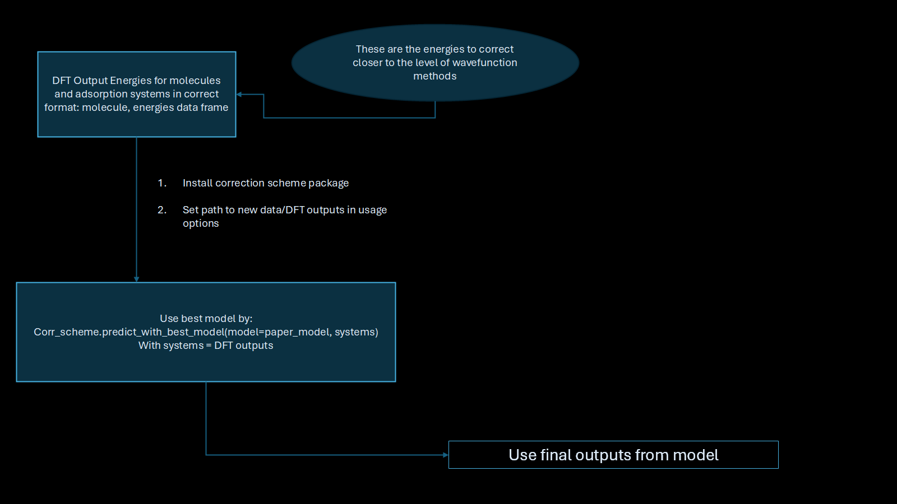

# Usage and Quick Start

This guide is intended to get users up and running using the best model from the paper to correct system energies. 
<!-- TODO: insert name of paper once on ArXiv -->

Note that using the correction scheme in its entirety will allow you to train correction models from scratch based on molecular data. This guide can be found under `tutorials/full_workflow_usage`

For this quick start, the flow will be: 

1. First, load your DFT output energies 
2.  

In order to use the correction scheme workflow

